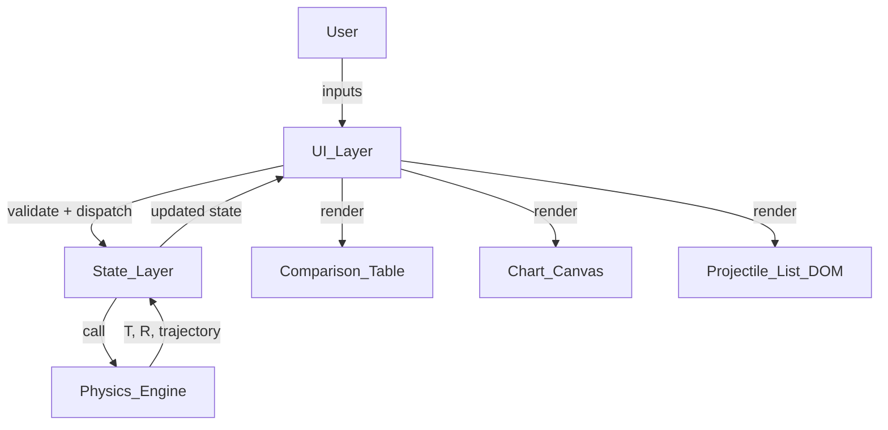

# Design Document: Projectile Motion Simulator

## Overview

The Projectile Motion Simulator is a pure client-side educational web application delivered as a single HTML file with embedded or linked CSS and JavaScript. No build tools, no backend, no installation — students open the file in any modern browser and start simulating immediately.

The application is structured around three logical layers:

1. **Physics_Engine** — a JavaScript module (ES module or IIFE) containing all kinematic calculation functions. It is stateless and pure: given inputs, it returns outputs with no side effects.
2. **State Layer** — a plain JavaScript object (`ProjectileList`) that holds the current array of `ProjectileEntry` objects and drives UI re-renders.
3. **UI Layer** — DOM manipulation functions that read from state, render inputs/results/chart, and dispatch user actions back to state.

Chart.js is loaded from a CDN. If the CDN is unavailable the chart section is hidden gracefully; all other functionality continues to work.

---

## Architecture



### File Structure

```
projectile-motion-simulator/
├── index.html          # Single entry point; contains all markup
├── style.css           # Cyberpunk-themed responsive stylesheet
└── app.js              # Physics_Engine + State + UI (or split into modules)
```

Alternatively, everything can be inlined into `index.html` for maximum portability. The modular split is preferred for testability.

### Module Boundaries

| Module | Responsibilities | Dependencies |
|---|---|---|
| `physics.js` | `computeT`, `computeR`, `computeTrajectory` | None (pure functions) |
| `state.js` | `ProjectileList` CRUD, validation orchestration | `physics.js` |
| `ui.js` | DOM rendering, event binding, Chart.js integration | `state.js` |
| `index.html` | Shell, CDN script tags | — |

---

## Components and Interfaces

### Physics_Engine (`physics.js`)

All functions are pure — no DOM access, no global state.

```js
/**
 * Compute time of flight.
 * @param {number} v0  Initial velocity (m/s), must be > 0
 * @param {number} theta  Launch angle (degrees), must be 0 < theta < 90
 * @param {number} g  Gravitational acceleration (m/s²), must be > 0
 * @returns {number} T rounded to 2 decimal places
 */
function computeT(v0, theta, g)

/**
 * Compute horizontal range.
 * @param {number} v0
 * @param {number} theta  (degrees)
 * @param {number} g
 * @returns {number} R rounded to 2 decimal places
 */
function computeR(v0, theta, g)

/**
 * Compute trajectory data points.
 * @param {number} v0
 * @param {number} theta  (degrees)
 * @param {number} g
 * @param {number} [numPoints=50]  Minimum 50
 * @returns {{ x: number, y: number }[]}  Array of {x, y} pairs
 */
function computeTrajectory(v0, theta, g, numPoints = 50)
```

Internal degree-to-radian conversion is handled inside each function via `theta * Math.PI / 180`.

### State Layer (`state.js`)

```js
// ProjectileEntry shape
{
  id: number,          // auto-increment, used as stable key
  label: string,       // "Projectile 1", "Projectile 2", …
  v0: string,          // raw input string (validated on calculate)
  theta: string,
  g: string,           // default "9.81"
  errors: {            // per-field error messages, null when valid
    v0: string | null,
    theta: string | null,
    g: string | null
  },
  result: {            // null until a successful calculation
    T: number | null,
    R: number | null,
    trajectory: { x: number, y: number }[] | null
  }
}

// ProjectileList shape
{
  entries: ProjectileEntry[],   // max 10
  nextId: number
}
```

Key state operations:

| Function | Description |
|---|---|
| `addEntry()` | Appends a new entry with defaults; no-op if length === 10 |
| `removeEntry(id)` | Removes entry by id; no-op if length === 1; re-labels remaining |
| `updateField(id, field, value)` | Updates a raw input field on an entry |
| `calculateAll()` | Validates all entries; if all valid, computes T/R/trajectory for each |
| `validateEntry(entry)` | Returns `{ valid: boolean, errors: {...} }` |

### UI Layer (`ui.js`)

| Function | Description |
|---|---|
| `renderProjectileList()` | Re-renders the entire input panel from state |
| `renderComparisonTable()` | Renders or clears the results table |
| `renderChart()` | Creates/updates the Chart.js instance |
| `renderFormulas()` | Static render of the formulas section (called once on load) |
| `bindEvents()` | Attaches delegated event listeners to the container |

### Chart.js Integration

A single `Chart` instance is created on first successful calculation and stored in a module-level variable. Subsequent calculations call `chart.data.datasets = newDatasets; chart.update()` rather than destroying and recreating the instance, which avoids flicker.

Distinct colours are drawn from a fixed palette of 10 colours (one per possible projectile):

```js
const PALETTE = [
  '#e63946', '#457b9d', '#2a9d8f', '#e9c46a', '#f4a261',
  '#264653', '#a8dadc', '#6d6875', '#b5838d', '#e76f51'
];
```

---

## Visual Design

### Theme: Cyberpunk

The UI draws inspiration from the cyberpunk aesthetic — dark backgrounds, neon accent colours, glitch-style typography, and a high-contrast "terminal" feel that makes the simulator look like a piece of futuristic lab equipment.

#### Colour Palette

| Role | Value | Usage |
|---|---|---|
| Background | `#0d0d0d` | Page and panel backgrounds |
| Surface | `#1a1a2e` | Input cards, table rows |
| Border | `#16213e` | Panel outlines |
| Neon Cyan | `#00f5ff` | Primary headings, labels, focus rings |
| Neon Magenta | `#ff00ff` | Buttons, active states, highlights |
| Neon Yellow | `#f5ff00` | Formula text, result values |
| Error Red | `#ff2d55` | Inline validation error messages |
| Body Text | `#c0c0c0` | Input values, table data |

#### Typography

- Headings: `'Orbitron'` or `'Share Tech Mono'` (Google Fonts) — angular, futuristic feel
- Body / inputs: `'Share Tech Mono'` or `monospace` fallback — terminal readability
- Formula section: monospace with neon yellow colour to evoke a HUD display

#### UI Elements

- Input fields: dark background (`#0d0d0d`), neon cyan border, glowing `box-shadow` on focus (`0 0 8px #00f5ff`)
- Buttons: neon magenta border with transparent background; on hover, fill with magenta and invert text colour
- Comparison table: dark surface rows with neon cyan header text and subtle row separators
- Chart area: dark canvas background with neon-coloured trajectory lines drawn from the cyberpunk `PALETTE`
- Error messages: neon red (`#ff2d55`), small monospace text below the offending field
- Section headings: uppercase, letter-spaced, neon cyan — styled like HUD section labels

#### Cyberpunk Chart Palette

Replace the default palette with neon colours suited to the dark background:

```js
const PALETTE = [
  '#00f5ff', // neon cyan
  '#ff00ff', // neon magenta
  '#f5ff00', // neon yellow
  '#00ff88', // neon green
  '#ff6b35', // neon orange
  '#bf5fff', // neon purple
  '#ff2d55', // neon red
  '#00cfff', // electric blue
  '#ffdd00', // amber
  '#39ff14'  // acid green
];
```

#### Responsive Behaviour

- Mobile (320–767 px): single-column stacked layout; inputs full-width; chart below table
- Tablet (768–1279 px): two-column input grid; chart beside table
- Desktop (1280–1920 px): three-column input grid; chart prominently displayed alongside results

---

## Data Models

### ProjectileEntry (runtime)

```
ProjectileEntry {
  id:      integer          -- stable identity across re-labels
  label:   string           -- display name, recomputed on remove
  v0:      string           -- raw DOM value; parsed to float on validate
  theta:   string           -- raw DOM value
  g:       string           -- raw DOM value, default "9.81"
  errors:  ErrorMap         -- null fields = no error
  result:  ResultMap | null -- null until calculated
}

ErrorMap {
  v0:    string | null
  theta: string | null
  g:     string | null
}

ResultMap {
  T:          number
  R:          number
  trajectory: Array<{x: number, y: number}>
}
```

### Validation Rules

| Field | Rule | Error message |
|---|---|---|
| v0 | Must be a finite number > 0 | "Initial velocity must be a positive number." |
| theta | Must be a finite number, 0 < θ < 90 | "Angle must be between 0 and 90 degrees (exclusive)." |
| g | Must be a finite number > 0 | "Gravitational acceleration must be a positive number." |
| any field | Must not be empty/NaN | "This field is required." |

### Chart Dataset (Chart.js)

```js
{
  label: "Projectile N",
  data: [{ x: number, y: number }, ...],   // 50+ points
  borderColor: PALETTE[index],
  backgroundColor: 'transparent',
  tension: 0.4,
  pointRadius: 0
}
```

---

## Correctness Properties

*A property is a characteristic or behavior that should hold true across all valid executions of a system — essentially, a formal statement about what the system should do. Properties serve as the bridge between human-readable specifications and machine-verifiable correctness guarantees.*


### Property 1: Invalid inputs are rejected by validation

*For any* Projectile_Entry where at least one field is empty, or v0 ≤ 0, or θ is outside (0°, 90°), or g ≤ 0, calling `validateEntry` SHALL return `valid: false` and set a non-null error message on every offending field.

**Validates: Requirements 2.1, 2.2, 2.3, 2.4**

### Property 2: Invalid entries block all calculations

*For any* Projectile_List that contains at least one invalid Projectile_Entry, calling `calculateAll` SHALL leave every entry's `result` field as `null` — no partial results are produced.

**Validates: Requirements 2.5**

### Property 3: T formula correctness

*For any* valid triple (v0 > 0, 0 < θ < 90, g > 0), `computeT(v0, θ, g)` SHALL return a value equal to `round2((2 × v0 × sin(θ_rad)) / g)`, where `round2` rounds to two decimal places.

**Validates: Requirements 3.1, 3.3, 3.4**

### Property 4: R formula correctness

*For any* valid triple (v0 > 0, 0 < θ < 90, g > 0), `computeR(v0, θ, g)` SHALL return a value equal to `round2((v0² × sin(2 × θ_rad)) / g)`, where `round2` rounds to two decimal places.

**Validates: Requirements 3.2, 3.3, 3.4**

### Property 5: Comparison_Table row count matches entry count

*For any* Projectile_List of 1–10 valid entries, after a successful `calculateAll`, the rendered Comparison_Table SHALL contain exactly as many data rows as there are entries in the list.

**Validates: Requirements 4.1, 4.5**

### Property 6: Result cells include units

*For any* computed result, the rendered table cell for T SHALL contain the string "s" and the rendered table cell for R SHALL contain the string "m" adjacent to the numeric value.

**Validates: Requirements 4.3**

### Property 7: Chart datasets mirror the Projectile_List

*For any* Projectile_List of 1–10 valid entries, after a successful `calculateAll`, the Chart SHALL have exactly as many datasets as entries, and each dataset's label SHALL equal the corresponding entry's label (e.g. "Projectile 1").

**Validates: Requirements 5.2, 5.3**

### Property 8: Trajectory points satisfy kinematic equations

*For any* valid triple (v0, θ, g) and any time sample `t` in [0, T], the trajectory point produced by `computeTrajectory` SHALL satisfy `x ≈ v0 × cos(θ_rad) × t` and `y ≈ v0 × sin(θ_rad) × t − 0.5 × g × t²` (within floating-point tolerance).

**Validates: Requirements 5.4**

### Property 9: Trajectory has at least 50 data points

*For any* valid triple (v0, θ, g), `computeTrajectory(v0, θ, g)` SHALL return an array of length ≥ 50.

**Validates: Requirements 5.5**

### Property 10: Sequential re-labelling after removal

*For any* Projectile_List of 2–10 entries, after removing any single entry, the remaining entries SHALL be re-labelled "Projectile 1", "Projectile 2", … in sequential order with no gaps.

**Validates: Requirements 6.2**

### Property 11: Projectile_List never exceeds 10 entries

*For any* sequence of `addEntry` calls, the `entries` array length SHALL never exceed 10, regardless of how many times `addEntry` is called.

**Validates: Requirements 6.4, 6.5**

### Property 12: Comparison_Table and Chart reflect only remaining entries after removal

*For any* Projectile_List after a calculation, removing any entry SHALL cause the Comparison_Table row count and the Chart dataset count to each equal the new (reduced) entry count.

**Validates: Requirements 6.6**

---

## Error Handling

### Validation Errors

- Validation runs on every entry before any calculation begins.
- If any entry is invalid, `calculateAll` returns early without calling Physics_Engine for any entry.
- Each entry's `errors` map is updated independently; the UI renders inline error messages directly below the offending input field.
- Errors are cleared on the next successful `calculateAll` or when the user edits the field.

### Chart.js Unavailability

- Chart.js is loaded via a `<script>` tag with `onerror` handler.
- If loading fails, a module-level flag `chartAvailable = false` is set.
- All chart-related UI sections are hidden via CSS class toggle.
- The rest of the application (inputs, validation, calculation, table) continues to function normally.

### Floating-Point Edge Cases

- `computeT` and `computeR` use `Math.round(value * 100) / 100` for rounding.
- `computeTrajectory` clamps `y` values to `Math.max(0, y)` so the trajectory never dips below ground due to floating-point imprecision near `t = T`.
- Division by zero is prevented by validation (g > 0 is enforced before Physics_Engine is called).

### DOM / State Consistency

- All state mutations go through the state module functions; the UI never mutates state directly.
- After every state mutation, the relevant UI render function is called to keep DOM and state in sync.

---

## Testing Strategy

### Dual Testing Approach

Both unit/example-based tests and property-based tests are used. They are complementary:

- **Unit tests** cover specific examples, concrete reference values, and structural UI checks.
- **Property tests** verify universal invariants across a wide range of generated inputs.

### Property-Based Testing

The Physics_Engine functions are pure and have a large, continuous input space — making them ideal candidates for property-based testing.

**Library**: [fast-check](https://github.com/dubzzz/fast-check) (JavaScript/TypeScript PBT library, no build required with the CDN/ESM build for browser, or via npm for Node-based test runner).

**Test runner**: Jest or Vitest (Node environment, no browser required for unit/property tests).

**Minimum iterations**: Each property test SHALL run a minimum of **100 iterations**.

**Tag format**: Each property test file includes a comment:
`// Feature: projectile-motion-simulator, Property N: <property_text>`

#### Property Tests to Implement

| Property | Test description | fast-check arbitraries |
|---|---|---|
| P1 | Invalid inputs rejected | `fc.float({ max: 0 })`, `fc.float({ min: 90 })`, empty strings |
| P2 | Invalid entries block all calculations | Mix of valid/invalid entries |
| P3 | T formula correctness | `fc.float({ min: 0.01, max: 1000 })` for v0, `fc.float({ min: 0.01, max: 89.99 })` for theta, `fc.float({ min: 0.01, max: 100 })` for g |
| P4 | R formula correctness | Same arbitraries as P3 |
| P5 | Table row count matches entry count | `fc.integer({ min: 1, max: 10 })` for list size |
| P6 | Result cells include units | Random T and R values |
| P7 | Chart datasets mirror entry list | `fc.integer({ min: 1, max: 10 })` for list size |
| P8 | Trajectory points satisfy kinematic equations | Same arbitraries as P3 |
| P9 | Trajectory has ≥ 50 points | Same arbitraries as P3 |
| P10 | Sequential re-labelling after removal | `fc.integer({ min: 2, max: 10 })` for list size, `fc.integer` for removal index |
| P11 | List never exceeds 10 entries | `fc.integer({ min: 11, max: 50 })` for number of add calls |
| P12 | Table and chart reflect remaining entries after removal | `fc.integer({ min: 2, max: 10 })` for list size |

### Unit / Example Tests

| Requirement | Test |
|---|---|
| 1.3, 1.4 | New entry has g defaulting to "9.81" |
| 1.7 | On init, entries.length === 1 |
| 3.5 | computeT(20, 45, 9.81) === 2.89 and computeR(20, 45, 9.81) === 40.77 |
| 4.2 | Comparison_Table has "Projectile", "Time of Flight (s)", "Horizontal Range (m)" headers |
| 5.1 | Chart canvas is visible after calculation when Chart.js is available |
| 5.6 | Chart x-axis label is "Horizontal Distance (m)", y-axis label is "Height (m)" |
| 5.7 | After second calculation, only new datasets are present |
| 6.1 | Each rendered entry has a Remove button |
| 6.3 | Remove button is disabled when entries.length === 1 |
| 7.1 | Formulas section contains T and R formula text |

### Integration / Smoke Tests

| Requirement | Test |
|---|---|
| 7.3 | Manual smoke test: open index.html in Chrome, Firefox, Safari, Edge |
| 7.4 | Manual responsive check at 320 px, 768 px, 1280 px, 1920 px viewport widths |
